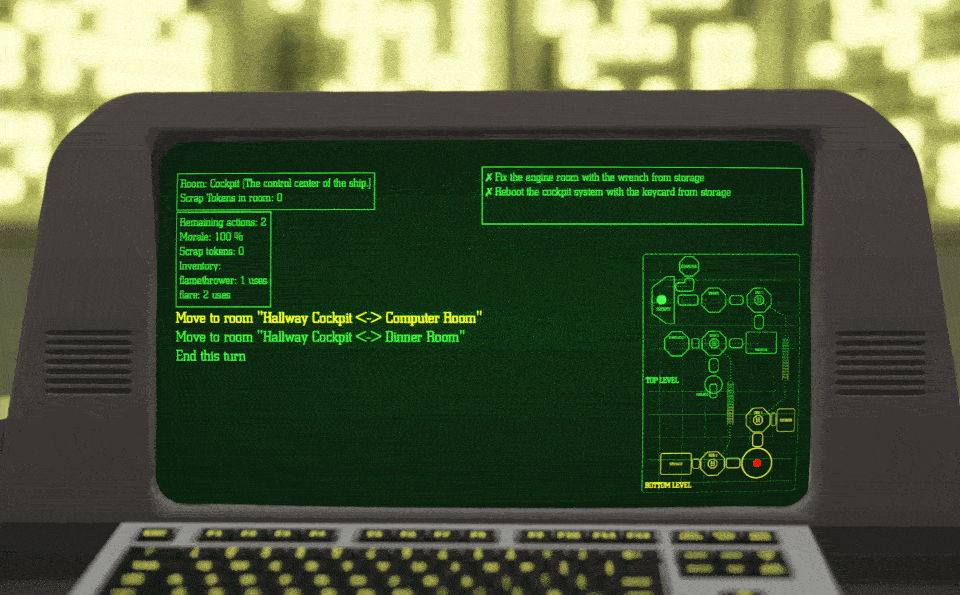

# Rustromo



## Overview

Rustromo is a small text-based game developed to train using Rust bindings (Gdext rust) in Godot 4. As the sole survivor on a ship overrun by a monster, you must navigate, evade, and find a way to escape.

## Gameplay

Each turn, use action points to move, collect, or use items like flares or the flamethrower. At the end of each turn, the monster moves closer by a random number of rooms. If the monster reaches you, flee to a space 3 rooms away and lose morale. If morale hits 0, it's game over.

Complete the objectives to escape the ship (WIP).

## Installation

### Prerequisites

- Rust
- Godot 4

### Steps
[TODO: incomplete]
1. **Compile the Rust part of the code:**
    ```sh
    cd rust
    cargo build --target aarch64-apple-darwin # For macOS M1
    ```

2. **Compile the Godot project:**
    ```sh
    # TODO: Add instructions to compile binaries
    ```

Enjoy the game and good luck surviving!
